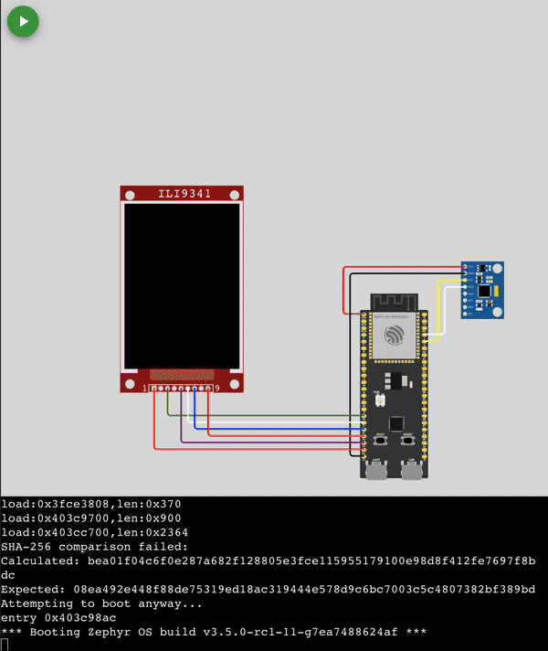

# Zephyr projects for use with Wokwi's VS Code extension

This repository contains a collection of Zephyr projects that have been pre-compiled for a variety of boards (ESP32-S3, ESP32-C3, and Raspberry Pi Pico) and that can be used with the [Wokwi VS Code extension](https://marketplace.visualstudio.com/items?itemName=Wokwi.wokwi-vscode).

  

## Usage

1. Install the [Wokwi VS Code extension](https://marketplace.visualstudio.com/items?itemName=Wokwi.wokwi-vscode).
2. Follow the [quick start instructions](https://docs.wokwi.com/vscode/getting-started) to activate the extension.
3. Open the command palette (Ctrl+Shift+P) and select "Wokwi: Select Config File" to select which project you want to simulate.
4. Open the command palette again and select "Wokwi: Start Simulation" to start the simulation.
5. Enjoy!

## Author <!-- omit in toc -->

👤 **Benjamin Cabé**

- Website: [https://blog.benjamin-cabe.com](https://blog.benjamin-cabe.com)
- Twitter: [@kartben](https://twitter.com/kartben)
- Github: [@kartben](https://github.com/kartben)
- LinkedIn: [@benjamincabe](https://linkedin.com/in/benjamincabe)

## 🤝 Contributing <!-- omit in toc -->

Contributions, issues and feature requests are welcome!

Feel free to check [issues page](https://github.com/kartben/wokwi-zephyr-projects/issues).

## Show your support <!-- omit in toc -->

Give a ⭐️ if this project helped you!

## 📝 License <!-- omit in toc -->

Copyright &copy; 2023 [Benjamin Cabé](https://github.com/kartben).

This project is [MIT](/LICENSE) licensed.

